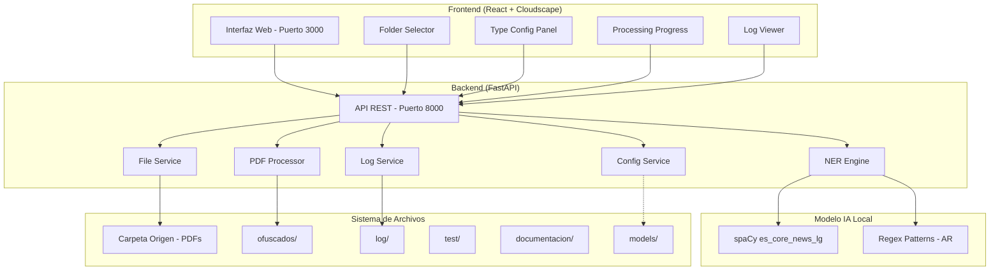
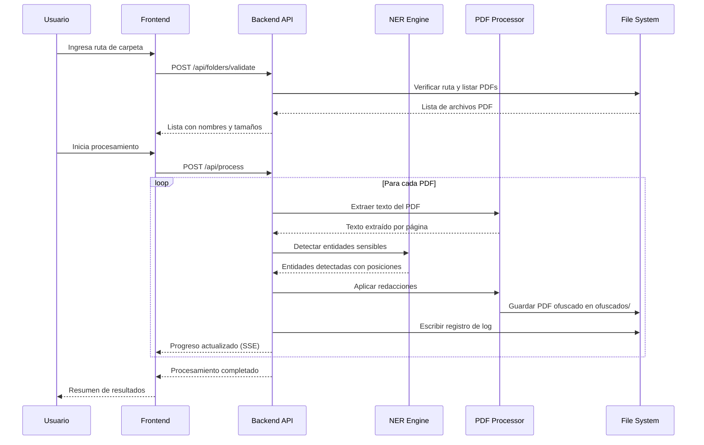

# Design Document: PDF Sensitive Data Redaction

## Overview

Esta aplicación es una herramienta local de ofuscación de datos sensibles en archivos PDF, diseñada para ejecutarse completamente en la máquina del usuario sin dependencias de servicios en la nube. La arquitectura sigue un patrón cliente-servidor donde un backend en Python (FastAPI) maneja el procesamiento de PDFs y la detección de entidades mediante NER, mientras que un frontend en React con Cloudscape Design System provee la interfaz de usuario en español.

### Decisiones Técnicas Clave

| Decisión | Elección | Justificación |
|----------|----------|---------------|
| Backend Framework | FastAPI | Async nativo, tipado fuerte con Pydantic, documentación automática OpenAPI, rendimiento superior a Flask para operaciones I/O |
| Frontend Framework | React + Cloudscape | Cloudscape provee componentes enterprise-ready, accesibles y con soporte de i18n |
| Motor NER | spaCy (`es_core_news_lg`) + regex custom | Modelo offline con F-score NER de 0.89, complementado con patrones regex para formatos argentinos específicos |
| Procesamiento PDF | PyMuPDF (fitz) | Permite búsqueda y reemplazo de texto preservando estructura del PDF, soporte de redacción nativa |
| Persistencia Config | JSON local | Simple, sin dependencias externas, editable manualmente si es necesario |
| Logging | Archivo JSON Lines | Un registro por línea, parseable y legible |

## Architecture

### Diagrama de Arquitectura General



### Flujo de Procesamiento



### Patrón de Comunicación

- **Frontend → Backend**: HTTP REST (JSON)
- **Backend → Frontend (progreso)**: Server-Sent Events (SSE) para actualizaciones en tiempo real durante el procesamiento
- **Despliegue**: FastAPI sirve los archivos estáticos del build de React, eliminando CORS y simplificando la ejecución

## Components and Interfaces

### Backend Components

#### 1. API Layer (`app/api/`)

```python
# app/api/routes.py
from fastapi import APIRouter, HTTPException
from pydantic import BaseModel
from typing import list

router = APIRouter(prefix="/api")

class FolderValidationRequest(BaseModel):
    path: str

class FolderValidationResponse(BaseModel):
    valid: bool
    files: list[FileInfo]
    error: str | None = None

class FileInfo(BaseModel):
    name: str
    size_bytes: int
    path: str

class ProcessRequest(BaseModel):
    folder_path: str
    file_names: list[str] | None = None  # None = procesar todos

class TypeConfig(BaseModel):
    nombre: bool = True
    email: bool = True
    celular: bool = True
    telefono: bool = True
    direccion: bool = True
    tarjeta_credito: bool = True
    cuenta_bancaria: bool = True
    dni: bool = True
    cuit_cuil: bool = True
    pasaporte: bool = True
```

#### 2. NER Engine (`app/ner/`)

```python
# app/ner/engine.py
from dataclasses import dataclass
from enum import Enum

class SensitiveDataType(str, Enum):
    NOMBRE = "NOMBRE"
    EMAIL = "EMAIL"
    CELULAR = "CELULAR"
    TELEFONO = "TELEFONO"
    DIRECCION = "DIRECCION"
    TARJETA_CREDITO = "TARJETA_CREDITO"
    CUENTA_BANCARIA = "CUENTA_BANCARIA"
    DNI = "DNI"
    CUIT_CUIL = "CUIT_CUIL"
    PASAPORTE = "PASAPORTE"

@dataclass
class DetectedEntity:
    text: str
    entity_type: SensitiveDataType
    start: int
    end: int
    confidence: float
    page: int

class NEREngine:
    """Motor de detección de entidades sensibles.
    
    Combina spaCy NER para nombres/direcciones con
    patrones regex para formatos argentinos específicos.
    """
    
    def __init__(self, model_path: str, config: TypeConfig):
        ...
    
    def detect(self, text: str, page: int) -> list[DetectedEntity]:
        """Detecta entidades sensibles en el texto dado."""
        ...
    
    def _detect_with_spacy(self, text: str, page: int) -> list[DetectedEntity]:
        """Usa spaCy para detectar PER, LOC."""
        ...
    
    def _detect_with_regex(self, text: str, page: int) -> list[DetectedEntity]:
        """Usa patrones regex para formatos argentinos."""
        ...
    
    def _resolve_conflicts(self, entities: list[DetectedEntity]) -> list[DetectedEntity]:
        """Resuelve conflictos cuando un dato coincide con múltiples tipos."""
        ...
```

#### 3. PDF Processor (`app/pdf/`)

```python
# app/pdf/processor.py
@dataclass
class ProcessingResult:
    input_file: str
    output_file: str
    success: bool
    entities_found: int
    entities_by_type: dict[str, int]
    error: str | None = None
    processing_time_ms: int = 0

class PDFProcessor:
    """Procesa PDFs aplicando redacciones basadas en entidades detectadas."""
    
    def __init__(self, output_dir: str, ner_engine: NEREngine):
        ...
    
    def process_file(self, file_path: str) -> ProcessingResult:
        """Procesa un archivo PDF completo."""
        ...
    
    def _extract_text_by_page(self, doc: fitz.Document) -> dict[int, str]:
        """Extrae texto de cada página del PDF."""
        ...
    
    def _apply_redactions(self, doc: fitz.Document, entities: list[DetectedEntity]) -> None:
        """Aplica redacciones usando el mecanismo de PyMuPDF."""
        ...
    
    def _generate_output_path(self, input_path: str) -> str:
        """Genera la ruta de salida con sufijo _ofuscado."""
        ...
```

#### 4. Config Service (`app/config/`)

```python
# app/config/service.py
class ConfigService:
    """Gestiona la configuración persistente de tipos de datos sensibles."""
    
    CONFIG_FILE = "config/types_config.json"
    
    def load(self) -> TypeConfig:
        """Carga configuración desde archivo. Retorna default si falla."""
        ...
    
    def save(self, config: TypeConfig) -> None:
        """Persiste la configuración actual."""
        ...
    
    def validate(self, config: TypeConfig) -> tuple[bool, str | None]:
        """Valida que al menos un tipo esté activo."""
        ...
```

#### 5. Log Service (`app/log/`)

```python
# app/log/service.py
@dataclass
class AuditLogEntry:
    filename: str
    file_size_bytes: int
    os_user: str
    timestamp: str  # ISO 8601
    result: str  # "success" | "error"
    entities_detected: int
    entities_by_type: dict[str, int]
    error_detail: str | None = None

class LogService:
    """Gestiona el registro de auditoría."""
    
    LOG_DIR = "log/"
    
    def write_entry(self, entry: AuditLogEntry) -> bool:
        """Escribe una entrada de log. Retorna False si falla."""
        ...
    
    def read_entries(self, page: int = 1, page_size: int = 100) -> list[AuditLogEntry]:
        """Lee entradas paginadas, ordenadas de más reciente a más antigua."""
        ...
```

### Frontend Components

#### Estructura de Componentes React

```
frontend/src/
├── App.tsx                    # Router principal
├── pages/
│   ├── ProcessingPage.tsx     # Página principal de procesamiento
│   ├── ConfigPage.tsx         # Configuración de tipos
│   └── LogsPage.tsx           # Visor de logs
├── components/
│   ├── FolderInput.tsx        # Input de ruta con validación
│   ├── FileList.tsx           # Lista de PDFs encontrados
│   ├── ProcessingProgress.tsx # Barra de progreso con SSE
│   ├── TypeToggle.tsx         # Toggle individual por tipo
│   └── LogTable.tsx           # Tabla de registros de auditoría
├── services/
│   ├── api.ts                 # Cliente HTTP para el backend
│   └── sse.ts                 # Cliente SSE para progreso
├── i18n/
│   └── es.ts                  # Traducciones en español
└── types/
    └── index.ts               # Tipos TypeScript compartidos
```

### API Endpoints

| Método | Endpoint | Descripción |
|--------|----------|-------------|
| POST | `/api/folders/validate` | Valida ruta y lista PDFs |
| POST | `/api/process` | Inicia procesamiento de PDFs |
| GET | `/api/process/status` | SSE stream de progreso |
| GET | `/api/config` | Obtiene configuración actual |
| PUT | `/api/config` | Actualiza configuración |
| GET | `/api/logs` | Lista registros de auditoría (paginado) |
| GET | `/api/health` | Health check del servidor |

## Data Models

### Modelo de Configuración (JSON persistido)

```json
{
  "version": 1,
  "types": {
    "nombre": true,
    "email": true,
    "celular": true,
    "telefono": true,
    "direccion": true,
    "tarjeta_credito": true,
    "cuenta_bancaria": true,
    "dni": true,
    "cuit_cuil": true,
    "pasaporte": true
  },
  "updated_at": "2024-01-15T10:30:00-03:00"
}
```

### Modelo de Log Entry (JSON Lines)

```json
{
  "filename": "contrato_servicio.pdf",
  "file_size_bytes": 245760,
  "os_user": "eduardo",
  "timestamp": "2024-01-15T14:30:22-03:00",
  "result": "success",
  "entities_detected": 12,
  "entities_by_type": {
    "NOMBRE": 3,
    "DNI": 2,
    "EMAIL": 2,
    "TELEFONO": 2,
    "DIRECCION": 2,
    "CUIT_CUIL": 1
  },
  "error_detail": null
}
```

### Patrones Regex para Formatos Argentinos

| Tipo | Patrón | Ejemplos |
|------|--------|----------|
| DNI | `\b\d{2}\.?\d{3}\.?\d{3}\b` | 32.456.789, 32456789 |
| CUIT/CUIL | `\b(20\|23\|24\|27\|30\|33\|34)\-?\d{8}\-?\d\b` | 20-32456789-4 |
| Teléfono +54 | `\+54\s?\d{2,4}\s?\d{4}\s?\d{4}` | +54 11 4567 8901 |
| Celular | `\+54\s?9?\s?\d{2,4}\s?\d{4}\s?\d{4}` | +54 9 11 4567 8901 |
| Email | `[a-zA-Z0-9._%+-]+@[a-zA-Z0-9.-]+\.[a-zA-Z]{2,}` | juan.perez@email.com |
| Tarjeta Crédito | `\b\d{4}[\s-]?\d{4}[\s-]?\d{4}[\s-]?\d{4}\b` | 4532-1234-5678-9012 |
| Pasaporte AR | `\bAA[A-Z]?\d{6}\b` | AAB123456 |

### Estructura de Carpetas del Proyecto

```
PDF-Datos-Sensibles/
├── app/                        # Backend Python
│   ├── __init__.py
│   ├── main.py                 # Entry point FastAPI
│   ├── api/                    # Rutas API
│   ├── ner/                    # Motor NER
│   ├── pdf/                    # Procesador PDF
│   ├── config/                 # Servicio de configuración
│   └── log/                    # Servicio de logging
├── frontend/                   # Frontend React
│   ├── src/
│   ├── public/
│   └── package.json
├── models/                     # Modelo spaCy descargado
├── config/                     # Archivos de configuración
│   └── types_config.json
├── log/                        # Registros de auditoría
├── ofuscados/                  # PDFs ofuscados generados
├── test/                       # PDFs de ejemplo
├── documentacion/              # Documentación del proyecto
│   ├── arquitectura.md
│   ├── guia_usuario.md
│   └── guia_instalacion.md
├── setup.sh                    # Instalador macOS
├── setup.bat                   # Instalador Windows
├── requirements.txt            # Dependencias Python
└── README.md
```

### Mapeo spaCy Entity → SensitiveDataType

| spaCy Label | SensitiveDataType | Notas |
|-------------|-------------------|-------|
| PER | NOMBRE | Personas detectadas por NER |
| LOC | DIRECCION | Ubicaciones (complementado con regex para direcciones completas) |
| MISC | — | Se descarta, no mapea a tipos sensibles definidos |
| ORG | — | Se descarta, organizaciones no son datos personales |

Los tipos EMAIL, CELULAR, TELEFONO, TARJETA_CREDITO, CUENTA_BANCARIA, DNI, CUIT_CUIL y PASAPORTE se detectan exclusivamente mediante patrones regex, ya que spaCy no los reconoce como entidades nombradas.

## Correctness Properties

*A property is a characteristic or behavior that should hold true across all valid executions of a system — essentially, a formal statement about what the system should do. Properties serve as the bridge between human-readable specifications and machine-verifiable correctness guarantees.*

### Property 1: Path length validation

*For any* string path, the path validation function SHALL accept paths with length ≤ 260 characters on Windows (or ≤ 1024 on macOS) and reject paths exceeding those limits, returning the appropriate OS-specific error message.

**Validates: Requirements 2.1, 9.5**

### Property 2: PDF file listing is case-insensitive

*For any* directory containing files with extensions in mixed case (.pdf, .PDF, .Pdf, .pDf, etc.), the file listing function SHALL return all files whose extension matches "pdf" case-insensitively, and SHALL NOT return files with other extensions.

**Validates: Requirements 2.2, 2.4**

### Property 3: Path error classification

*For any* invalid path (non-existent, not a directory, or without read permissions), the validation function SHALL return an error with the correct cause classification matching the specific failure condition.

**Validates: Requirements 2.3**

### Property 4: Argentine format regex detection

*For any* valid Argentine-format sensitive data (DNI in XX.XXX.XXX or XXXXXXXX format, phone with +54 prefix followed by 10 digits, CUIT/CUIL in XX-XXXXXXXX-X format, valid email addresses, credit card numbers in 16-digit format, and passport in AAX######), the regex detection engine SHALL match and classify the data with the correct `SensitiveDataType`.

**Validates: Requirements 3.2, 3.3**

### Property 5: Confidence threshold filtering

*For any* detected entity with a confidence score, the NER engine SHALL include it in results if and only if its confidence is ≥ 0.70.

**Validates: Requirements 3.4**

### Property 6: Conflict resolution by highest confidence

*For any* text span that matches multiple `SensitiveDataType` patterns with different confidence scores, the conflict resolution function SHALL assign the type with the highest confidence score.

**Validates: Requirements 3.6**

### Property 7: Detection respects type configuration

*For any* type configuration and any text containing sensitive data of various types, the NER engine SHALL detect only entities whose type is enabled in the configuration, and SHALL NOT detect entities whose type is disabled.

**Validates: Requirements 4.3, 4.4**

### Property 8: Configuration persistence round-trip

*For any* valid `TypeConfig` object, saving it to disk and then loading it back SHALL produce an equivalent configuration with all type toggle values preserved.

**Validates: Requirements 4.5**

### Property 9: Corrupted configuration fallback

*For any* invalid or corrupted configuration data (malformed JSON, missing fields, invalid values), the config loader SHALL return the default configuration with all types set to active.

**Validates: Requirements 4.6**

### Property 10: Minimum one active type validation

*For any* configuration where all types are set to inactive (false), the validation function SHALL reject the configuration and return an error indicating at least one type must be active.

**Validates: Requirements 4.7**

### Property 11: Redaction replaces with correct label

*For any* text containing detected sensitive data of a given type, the redaction function SHALL replace each occurrence with the corresponding `[TIPO]` label, and the resulting text SHALL NOT contain the original sensitive data.

**Validates: Requirements 5.1, 5.6**

### Property 12: PDF structure preservation

*For any* PDF document processed for redaction, the output PDF SHALL have the same number of pages as the input, and all non-sensitive text content SHALL remain unchanged.

**Validates: Requirements 5.3**

### Property 13: Output filename generation

*For any* input PDF filename, the output path generation function SHALL produce a filename with the suffix `_ofuscado` inserted before the `.pdf` extension, placed in the `ofuscados/` directory.

**Validates: Requirements 5.5, 10.5**

### Property 14: Audit log entry round-trip

*For any* `AuditLogEntry` with all required fields (filename, file_size_bytes, os_user, timestamp in ISO 8601 with timezone, result, entities_detected, entities_by_type), writing it to the log file and reading it back SHALL produce an equivalent entry with all fields preserved and timestamp in valid ISO 8601 format.

**Validates: Requirements 8.1, 8.2, 8.4**

### Property 15: Log ordering and pagination

*For any* set of log entries with distinct timestamps, the retrieval function SHALL return them in descending chronological order (most recent first), and each page SHALL contain at most 100 entries.

**Validates: Requirements 8.3**

### Property 16: Path handling with special characters

*For any* valid file path containing spaces, accented characters (á, é, í, ó, ú, ñ), and OS-native separators, the file operations (read, write, list) SHALL complete without errors and correctly reference the intended file.

**Validates: Requirements 9.3**

### Property 17: Original file integrity

*For any* PDF file processed by the system, the original file in the source folder SHALL remain byte-for-byte identical (same hash) after processing completes.

**Validates: Requirements 10.4**

## Error Handling

### Estrategia de Errores por Capa

| Capa | Tipo de Error | Comportamiento |
|------|---------------|----------------|
| API | Validación de input | HTTP 422 con detalle del campo inválido |
| API | Recurso no encontrado | HTTP 404 con mensaje descriptivo |
| File Service | Ruta inválida/sin permisos | Error clasificado (NOT_FOUND, NOT_DIR, NO_PERMISSION) |
| NER Engine | Modelo no cargado | Error fatal al inicio, impide procesamiento |
| PDF Processor | PDF corrupto/protegido | Log error, skip archivo, continuar cola |
| PDF Processor | Error de escritura en ofuscados/ | Error fatal para ese archivo, log, continuar |
| Config Service | Config corrupta | Fallback a defaults, notificar usuario |
| Log Service | No puede escribir log | Warning en UI, continuar procesamiento |

### Clasificación de Errores

```python
class AppError(Exception):
    """Error base de la aplicación."""
    def __init__(self, code: str, message: str, recoverable: bool = True):
        self.code = code
        self.message = message
        self.recoverable = recoverable

class PathValidationError(AppError):
    """Errores de validación de rutas."""
    pass

class PDFProcessingError(AppError):
    """Errores durante el procesamiento de PDFs."""
    pass

class ConfigError(AppError):
    """Errores de configuración."""
    pass
```

### Manejo de Errores durante Procesamiento Batch

El sistema procesa archivos en cola. Si un archivo falla:
1. Se registra el error en el log de auditoría
2. Se notifica al frontend vía SSE
3. Se continúa con el siguiente archivo
4. Al finalizar, el resumen indica cuántos archivos fallaron y por qué

### Errores Fatales vs Recuperables

- **Fatales** (detienen la aplicación): modelo NER no encontrado, puerto ocupado sin alternativa, sin permisos en directorio de la app
- **Recuperables** (continúan operación): PDF individual corrupto, error de escritura en log, config corrupta (usa defaults)

## Testing Strategy

### Enfoque Dual de Testing

La estrategia combina tests unitarios para casos específicos con tests basados en propiedades para verificar comportamiento universal.

### Property-Based Testing

**Librería**: [Hypothesis](https://hypothesis.readthedocs.io/) (Python)

**Configuración**:
- Mínimo 100 iteraciones por property test
- Cada test referencia su propiedad del documento de diseño
- Tag format: `Feature: pdf-sensitive-data-redaction, Property {N}: {título}`

**Properties a implementar** (17 propiedades del documento de diseño):
- Properties 1-3: Validación de rutas y listado de archivos
- Properties 4-6: Motor NER (regex, threshold, conflictos)
- Properties 7-10: Configuración de tipos
- Properties 11-13: Ofuscación y generación de archivos
- Properties 14-15: Sistema de logging
- Properties 16-17: Compatibilidad de rutas y integridad de archivos

### Unit Tests (pytest)

**Casos específicos y edge cases**:
- Puerto 3000 ocupado → mensaje de error correcto
- PDF sin datos sensibles → mensaje informativo
- PDF protegido con contraseña → error logged, skip
- Todos los tipos desactivados → rechazo con mensaje
- Carpetas inexistentes al inicio → creación automática
- Test PDFs procesados correctamente → todos los tipos detectados

### Integration Tests

**End-to-end con datos de prueba**:
- Procesamiento completo de carpeta test/ con 3 PDFs
- Verificación de archivos generados en ofuscados/
- Verificación de entradas en log/
- Verificación de que originales no se modifican

### Estructura de Tests

```
tests/
├── unit/
│   ├── test_ner_engine.py          # Properties 4-7
│   ├── test_regex_patterns.py      # Property 4
│   ├── test_config_service.py      # Properties 8-10
│   ├── test_pdf_processor.py       # Properties 11-13
│   ├── test_log_service.py         # Properties 14-15
│   ├── test_path_validation.py     # Properties 1-3, 16
│   └── test_file_integrity.py      # Property 17
├── integration/
│   ├── test_full_pipeline.py       # End-to-end processing
│   ├── test_api_endpoints.py       # API contract tests
│   └── test_startup.py             # Smoke tests
└── conftest.py                     # Fixtures compartidos
```

### Herramientas

| Herramienta | Uso |
|-------------|-----|
| pytest | Test runner principal |
| hypothesis | Property-based testing |
| pytest-cov | Cobertura de código |
| httpx | Testing de API endpoints |
| pytest-asyncio | Tests async para FastAPI |

